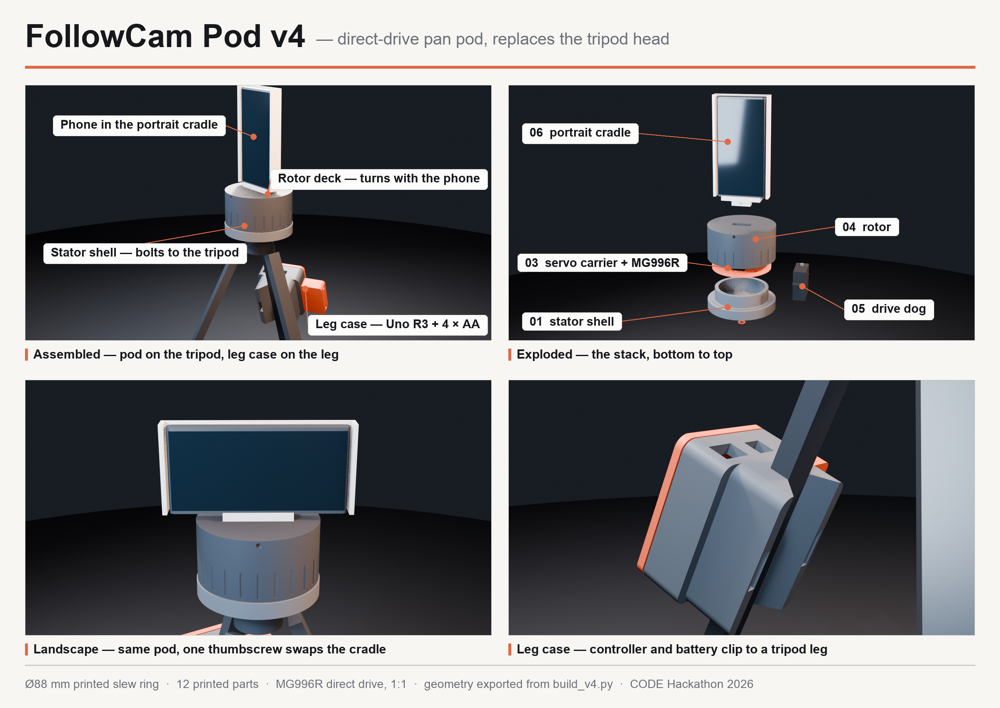

# FollowCam — the €20 robot cameraman

A 3D-printed pan pod that **replaces the head of an ordinary tripod** and steers
a phone to automatically follow the ball — turning a tripod you already own into
an auto-tracking sports camera, instead of a €2,000+ Veo/Pixellot unit.

Built at the CODE University Berlin one-day hackathon (Aug 28, 2026). The pod is
the second-generation design; it replaced the original rig, which clamped a servo
to the tripod's centre column and pushed the pan handle with a printed fork arm.



## How it works

Phone in the pod's cradle streams to a laptop → OpenCV tracks the ball (HSV) →
laptop sends `A<angle>\n` over USB serial → the Arduino drives the servo → the
servo turns the **rotor** directly, on a Ø88 mm printed slew ring wrapped around
it, and the phone turns with the rotor.

The drive is direct and 1:1. There is no linkage: nothing rides a handle shaft,
so there is no lost motion between the servo horn and the camera. The firmware
keeps the original `A40`–`A140` command range and remaps it across the pod's full
180° of pan (×1.8), slew-rate limited to 30°/s with 60°/s² of acceleration, so the
camera tracks rather than snaps.

Portrait and landscape are two different cradles on the same keyed rotor socket —
one thumbscrew swaps them, no reprint. The tongue is offset forward so the pan
axis bisects the phone's thickness in both orientations, which is what keeps the
two orientations equally balanced.

The Arduino and its battery live in a separate case that clips onto a tripod leg,
so nothing rotates with the phone and no cable wraps the pan axis.

Walkthroughs: `cad/blender/pod_v4/FollowCam_Pod_v4.mov` (27.8 s, the pod itself)
and `viz/final/final.mov` (8 s, the motion synced to a court-coverage diagram).

Every part, what it does and what it bolts to, in an interactive 3D explorer:
[`atlas/`](atlas/README.md) — orbit, click any part, scrub the exploded view.

## Repo map

| Path | What it is |
|------|-----------|
| `IDEA.md` | Pitch, market story, demo plan, fallback ladder |
| `PLAN.md` | Minute-by-minute hackathon execution plan |
| `docs/FINDINGS.md` | **All findings + decisions to date, summarized** |
| `cad/blender/pod_v4/` | **The current design** — `build_v4.py`, 12 verified STLs, renders, print + assembly handoff |
| `atlas/` | Interactive 3D part explorer for the pod (and the two hackathon headsets) |
| `cad/blender/` | Pod v3 — superseded, kept for history. Does not build; do not print from `exports/` |
| `cad/` | OpenSCAD sources for the original pan-handle linkage — superseded |
| `print/` | Sliced `.bgcode` for the original linkage parts (0.4 nozzle, std + HF) |
| `software/ball_tracker.py` | HSV ball tracker → serial angle commands |
| `software/servo_pod180/` | **Current firmware** — `A<angle>` protocol remapped across the pod's 180° |
| `software/servo_pan/` | Original linkage firmware — superseded, do not flash onto the pod |
| `tripod-photos/`, `annotated/` | Reference photos of the actual tripod, with measurement callouts |
| `viz/` | Product poster (`make_pod_v4_poster.py` regenerates it), pan-demo video, edit plan |
| `pitch/` | Pitch outline, stage script, deck |

## Hardware

- A tripod with a removable head and a 1/4-20 screw (ours: MACTREM PT55). The pod
  takes the head's place — it does not clamp to anything.
- A standard-size hobby servo on the carrier plate, and an Arduino Uno R3 and its
  battery in the leg case.
- 12 printed parts. Print list, bed orientations, support notes and assembly order:
  [`cad/blender/pod_v4/README.md`](cad/blender/pod_v4/README.md).

**Two things to settle before you print part 05.** The CAD is cut for an **MG996R**
(`03_servo_carrier_MG996R.stl`, and the drive dog is dimensioned to the servo's
height), while the current firmware header specifies a **DS3218** 270° positional
servo. The drive dog is the one part sized to the servo, so measure the servo you
actually have — the pod README explains which of the two dogs to print. Likewise,
the leg case carries a 4 × AA bay, but the firmware calls for a regulated 6 V / 3 A
supply; AA alkalines sag hard under servo stall current, so bench-test the pack
before trusting it to a match.

Never power the servo from the Uno's 5 V pin. Use the external pack and common the
grounds — see `hardware/WIRING.md`.

## Workflow (read this, Sammy 👋)

- `main` is protected: **all changes go through a PR reviewed by Malek**.
- Push feature branches (`sammy/<topic>`), open a PR, request review.
- Never commit render intermediates (`viz/work/`, frames, proxies) — they're
  regenerable and gitignored.

## Analytics pipeline

The same camera keeps the stats. `vision/` turns a clip into labeled players,
ball and hoop, tracks with jersey numbers, a 2D court model, per-player shot
stats, a coach dashboard and a live score overlay. Stage by stage with the
exact commands, inputs, outputs and measured numbers: [`docs/VISION.md`](docs/VISION.md);
results of the fine-tune in [`docs/RESULTS.md`](docs/RESULTS.md); data handling
in [`docs/PRIVACY.md`](docs/PRIVACY.md).

```
.venv/bin/python -m vision.run_all --clip data/clips/dev60.mp4        # whole pipeline, or: make demo CLIP=...
.venv/bin/python -m vision.live.live --source 0 --minimap panel        # live score overlay from a camera
```
