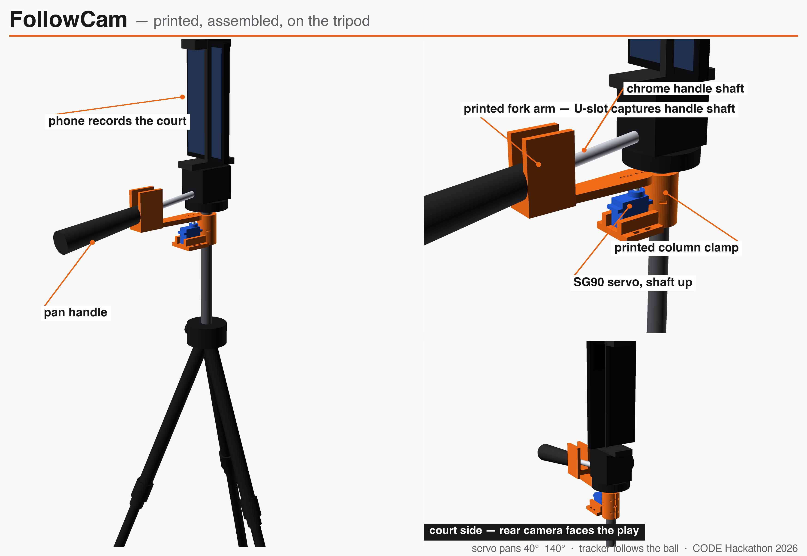

# FollowCam — the €20 robot cameraman

A 3D-printed robotic actuator that grips the pan handle of an ordinary tripod
and steers a phone to automatically follow the ball — turning a tripod you
already own into an auto-tracking sports camera for ~€20, instead of a
€2,000+ Veo/Pixellot unit.

Built at the CODE University Berlin one-day hackathon (Aug 28, 2026).

## How it works

Phone on the tripod head streams to a laptop → OpenCV tracks the ball (HSV) →
laptop sends `A<angle>\n` over USB serial → Arduino drives an SG90 servo →
the servo, clamped to the tripod's center column just below the head, turns a
printed **fork arm** whose U-slot captures the pan handle's chrome shaft and
pushes it left/right → the camera pans to keep the ball centered.

Because the servo shaft sits right next to the pan axis, servo angle ≈ pan
angle (near 1:1). Sweep is software-limited to 40°–140° (±50°); from the
scorer's-table spot a court needs only ±43° to cover both baseline corners.

An 8-second demo of the motion, synced to a top-down court-coverage diagram:
`viz/final/final.mov`.

## Repo map

| Path | What it is |
|------|-----------|
| `IDEA.md` | Pitch, market story, demo plan, fallback ladder |
| `PLAN.md` | Minute-by-minute hackathon execution plan |
| `docs/FINDINGS.md` | **All findings + decisions to date, summarized** |
| `cad/` | OpenSCAD sources (`followcam-rig.scad` = printed parts, `assembly.scad` = full-rig visual), STLs, `MEASUREMENTS.md` |
| `print/` | Sliced `.bgcode` files, ready to print (0.4 nozzle, std + HF) |
| `software/ball_tracker.py` | HSV ball tracker → serial angle commands |
| `software/servo_pan/servo_pan.ino` | Arduino firmware: `A<angle>` protocol, slew-rate-limited motion |
| `tripod-photos/` | Reference photos + video of the actual tripod |
| `annotated/` | Photos annotated with the measurement callouts |
| `viz/` | Assembly poster, pan-demo video (`final/final.mov`), and the edit plan to regenerate them |
| `pitch/` | Pitch outline |

## Hardware

- Any pan-handle tripod (ours: 15 mm center column, 8.5 mm chrome handle shaft)
- SG90 hobby servo (from the Elegoo Uno kit) — MG990/MG995/MG996R drop into
  the same bracket for more torque (set the two servo dims in the SCAD;
  power from external 5–6 V, common ground)
- Arduino Uno/Nano, phone, two printed parts (25–35% infill, no supports)

## Workflow (read this, Sammy 👋)

- `main` is protected: **all changes go through a PR reviewed by Malek**.
- Push feature branches (`sammy/<topic>`), open a PR, request review.
- Never commit render intermediates (`viz/work/`, frames, proxies) — they're
  regenerable and gitignored.
