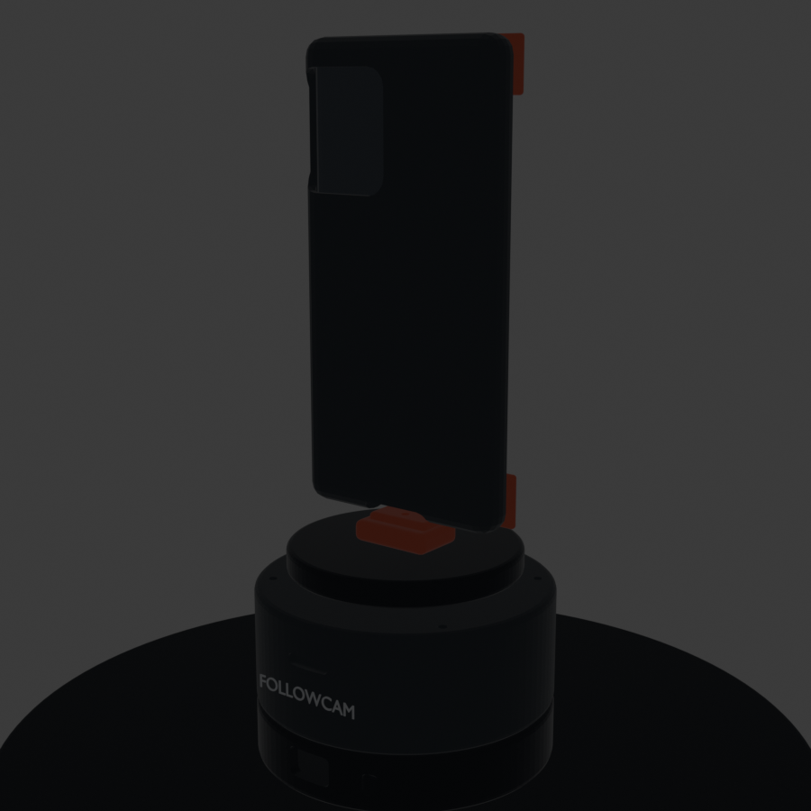

> **SUPERSEDED — see `pod_v4/` for the current design.**
>
> This v3 generation does not build: 5 of the 6 files in `exports/` are 84-byte
> zero-triangle STLs (the export ran but wrote nothing), and `pod180/build.py`
> aborts partway with a 3-component servo carrier. Kept for history only.
> **Do not print anything from `exports/` or `pod180/STL/`.**

# FollowCam Pod v3 — Blender redesign

This folder replaces the original column clamp + handle fork with a direct-drive,
tripod-top product. It keeps the repo's existing Arduino serial protocol and its
40–140° (±50°) pan envelope, but packages the phone, MG996R servo, Uno R3, bearing,
and service access into one clean pod.



## Deliverables

- `followcam_pod_v3.blend` — editable Blender 5.2 assembly, with separate named
  collections for the enclosure, electronics, portrait cradle, landscape cradle,
  and hidden print exports.
- `followcam_pod_v3.py` — reproducible parametric build script.
- `exports/` — six STL files: lower shell, upper shell, servo carrier, rotating
  platter, portrait full-wrap phone case, and landscape full-wrap phone case.
- `renders/` — portrait, landscape, and exploded product views.

Regenerate everything from the repo root:

```bash
blender --background --python cad/blender/followcam_pod_v3.py
```

## Interface dimensions and source links

The tripod in the repository photos is treated as the **MACTREM PT55**. The
manufacturer is no longer a reliable primary web source, so these are the best
cross-checkable dimensions available online:

| Interface | Dimension used | Source / consequence |
|---|---:|---|
| Camera screw | 1/4 in standard screw | [PT55 listing](https://www.falabella.com.pe/falabella-pe/product/120414526/Tripode-Mactrem-para-camaras-PT55-Negro/120414527); pod uses a 6.8 mm clearance and captive 1/4-20 insert pocket |
| PT55 quick-release plate top | 65 x 45 mm | [PT55 replacement plate](https://www.tripodp.com/products/camera-quick-release-plate-mactrem-pt55-travel.html) |
| PT55 tapered receiver footprint | approximately 44 x 44 mm | [measured replacement plate](https://www.tripodp.com/products/43mm-tripod-quick-release-plate-mactrem-pt55.html) |
| Tripod payload | listed as 4–5 kg depending seller | [PT55 product listing](https://simaro.co/mactrem-pt55-de-viajes-de-la-camara-de-tripode-de-aluminio-de-peso-ligero-para-dslr-slr-canon-nikon-sony-olympus-dv-con-bolsa-de-transporte-y-11-libras-5-kg-de-carga-azul) |
| Pivo reference envelope | 73 x 63 mm, 176 g, 1/4 in thread, 1 kg phone payload | [Pivo Pod 2 specifications](https://pivo.ai/products/pivo-pod-2) |

The FollowCam body is 112 mm diameter because an Uno R3 is 68.6 x 53.4 mm and a
full-size MG996R must fit above it. Pivo's much smaller commercial PCB and motor
cannot be matched with the hackathon components without making the enclosure
unserviceable.

## Mechanical architecture

1. **Lower shell:** 4 mm nominal wall, Uno R3 standoffs, USB-B opening, power
   opening, central 1/4-20 insert pocket, and four enclosure fastener points.
2. **Upper shell:** MG996R service volume, ventilation, status-light window,
   screw access, and a concentric 51100 thrust-bearing seat.
3. **Servo carrier:** replaceable plate sized for a 40.7 x 19.7 mm MG996R-class
   body and clone-tolerant M3 flange holes.
4. **Rotating platter:** direct 1:1 horn pattern, bearing seat, centred keyed
   cradle receiver, and 88 mm bearing footprint.
5. **Two full-wrap phone attachments:** separate portrait and landscape shells.
   Each has a 2.6 mm back, perimeter rails, four front corner retention lips,
   a camera opening, a charging opening, and a centred keyed tongue.

The default phone placeholder is **78.5 x 165 x 11.5 mm**, plus 0.8 mm total fit
clearance. Change `PHONE_W`, `PHONE_H`, and `PHONE_T` at the top of the Python
script after measuring the actual phone with its everyday case.

## Balance and motion

- The tripod screw, servo output, thrust bearing, platter, keyed receiver, and
  phone horizontal centre are coaxial. Switching orientation therefore does not
  introduce a static yaw imbalance.
- The thrust bearing carries the phone and cradle load; the servo spline transmits
  torque rather than acting as the structural bearing.
- The direct drive is 1:1, so the existing firmware's 40–140° range maps directly
  to ±50° of camera pan. No control-law or linkage calibration change is required.
- For a 250 g phone, even the landscape yaw inertia is only about 0.00057 kg·m².
  At 120°/s², ideal inertial torque is roughly 0.0012 N·m (0.12 kg·cm), far below
  an MG996R-class servo's nominal torque. Bearing friction, cable drag, and servo
  backlash will dominate in the real build.

“Perfect” rotation cannot be guaranteed from CAD alone. Before trusting a phone,
bench-test the printed bearing fit, inspect servo backlash, route the USB cable
with a loose service loop, and tune the endpoint/slew constants with the real mass.

## Build notes

- Print enclosure/platter in PETG or ASA, 0.20 mm layers, 4 perimeters, 35–45%
  gyroid infill. Print phone shells in PETG; TPU corner inserts are recommended.
- Hardware: MG996R-class servo, Arduino Uno R3, 51100 thrust bearing (10 x 24 x
  9 mm), aluminium servo horn, 1/4-20 heat-set/captive insert, M3 heat-set inserts,
  M3 screws, 5–6 V supply capable of at least 2 A, and non-slip rubber sheet.
- Do **not** power an MG996R from the Uno 5 V pin. Use the external supply and
  join its ground to Arduino ground as described in `hardware/WIRING.md`.
- Prototype the 1/4-20 insert coupon and phone corner fit before the long prints.
- Fit-check against the actual PT55 plate. Replacement-plate listings disagree by
  a few millimetres, which is exactly why the pod uses the universal screw rather
  than reproducing the proprietary PT55 dovetail.

